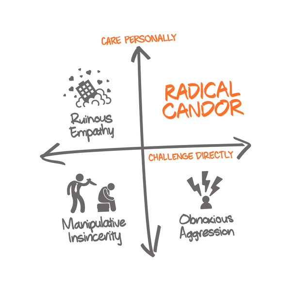

# What's this?

This is a manual for who I am, how I manage, and what I expect from my direct reports. I hope that by writing this you'll be better able to work with me and expect my quirks. I also hope that by letting you know how I plan to manage, that you can hold me accountable to this document and make sure I'm doing what I say I'll do.

# 1:1's

We will have a ~30 minute weekly 1:1. This takes precedence over all my other meetings. It's also ok if they go long, or we have to schedule extra time. If either of us are unable to attend, I expect that we reschedule for a different time in the same day or at worst the following day. The goal for our 1:1's is to discuss substance, not merely updates. How do you feel about your career? What about your work-life balance? What's something you would change in your work? Any feedback for me as a manager? I'll also try to give you regular feedback in and out of 1:1's as well.

I tr 

# Feedback

No matter how good you are at your job, there are ways for you to improve. My job as your manager is to make sure you are doing your best work. This is not only good for the company, but good for your career. Try your best not to take critical feedback personally. Easier said than done right? 

I aim to follow [Radical Candor](https://www.radicalcandor.com/) when I give feedback. That means my feedback is direct and timely, but that I'm giving it because I care personally. 

Please hold me accountable to that! You will be the most successful as you receive this candid feedback often. If I haven't give you feedback lately, call me out on it. My default feedback type is ruinous empathy. This feedback type is
